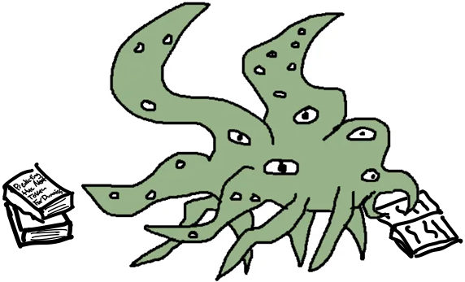
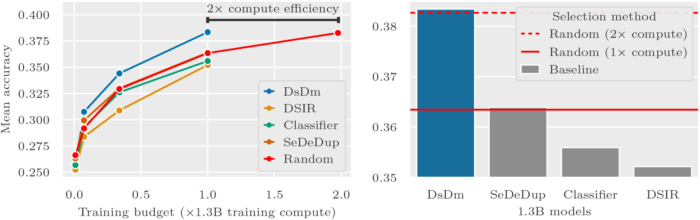

<p align = 'center'>
  
</p>
<p align = 'center'>
  
</p>
<p align='center'>
[<a href="https://gradientscience.org/dsdm">blog post</a>]
[<a href="https://arxiv.org/abs/2401.12926">paper</a>]
[<a href="#installation">install</a>]
[<a href="#datasets">datasets</a>]
[<a href="#selecting-data">select data</a>]
<br>
  By: 
<a href="https://twitter.com/logan_engstrom">Logan Engstrom</a>,
<a href="https://twitter.com/axel_s_feldmann">Axel Feldmann</a>,
<a href="https://twitter.com/aleks_madry">Aleksander Madry</a>
</p>


<p align = 'center'>
  <b>DsDm</b> is a <i>model-aware</i> dataset selection method that can greatly improve downstream model performance...
</p>
<p align = 'center'>

  </p>
  <p align = 'center'>
  ...see <a href="https://arxiv.org/abs/2401.12926">our paper</a> for more details!
</p>

## Installation
Install the python packages necessary:
```bash
git clone git@github.com:madrylab/DsDm.git
cd DsDm
pip install -r requirements.txt
```

## Datasets
We list instructions on how to both (a) load our candidate dataset and (b) select with each studied selection method (DsDm and baselines).

### Candidate dataset
The candidate dataset we select with is available on <a href="https://huggingface.co/datasets/loganengstrom/dsdm-candidate-c4">Hugging Face</a>. It is a tokenized version of the C4 `en.noblocklist` split <a href="https://huggingface.co/datasets/c4">prepared by AllenAI</a> (see Appendix A.1 of our work for more details); each example is 1024 tokens.

To load the dataset and display a slice:

```python
from dsdm import selections, utils

# load dataset and tokenizer
# (WARNING: this will download a 400GB dataset)
ds = selections.get_candidate_dataset()
tokenizer = utils.tokenizer_maker()

# display the first example in text form
text = tokenizer.decode(ds[0])
```

### Loading selections
We provide selections for five methods (`dsdm`, `classifier`, `dsir`, `random`, and `semdedup`) and six target tasks (`jeopardy`, `squad`, `lambada`, `cs_algorithms`, `lm_task_mix`, `gpt3_mix`). Below, we describe how to load these selections.

#### Download dependencies
Loading selections requires some setup. First, <a href="https://docs.github.com/en/repositories/working-with-files/managing-large-files/installing-git-large-file-storage">install git lfs</a>. Then, pull all the required metadata files:
```bash
git lfs fetch --all
```

#### Selecting data
Then load the selections:
```python
from dsdm import selections, utils

# targeted methods: dsdm, classifier, dsir
method = "dsdm"
target = "squad"
num_examples = 100_000
indices = get_indices(method, num_examples, target)

# untargeted methods: semdedup, random
method = 'semdedup'
num_examples = 100_000
indices = get_indices(method, num_examples, target)

# select a subset
ds = selections.get_candidate_dataset()
selected_ds = ds.select(indices)
```


## Selecting data

🚧 Coming soon! 🏗️
